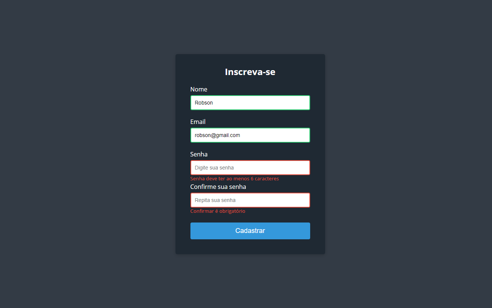

# Form Validator 

Estudos em validação de formulário

 

 

## Intro Project

Simple client side form validation. Check required, length, email and password match

 

## Project Specifications

- Create form UI
- Show error messages under specific inputs
- checkRequired() to accept array of inputs
- checkLength() to check min and max length
- checkEmail() to validate email with regex
- checkPasswordsMatch() to match confirm password

 

## Links

+ [Form data validation - Mozilla Learn](https://developer.mozilla.org/pt-BR/docs/Learn/Forms/Form_validation)
+ [Como Validar um endereço de email no JavaScript](https://stackoverflow.com/questions/46155/how-to-validate-an-email-address-in-javascript) 
+ [Validation - Bootstrap v5.0](https://getbootstrap.com/docs/5.0/forms/validation/)
+ [Form Validation - Angular](https://angular.io/guide/form-validation)
+ [Form Validation](https://formvalidation.io/)

 

## Fonte Utilizada no Projeto

+ [Open Sans](https://fonts.google.com/specimen/Open+Sans?query=open+)
  + Regular 400
  + Semi-Bold 600
  + Semi-Bold Italic
  + Bold 700
  
 

## Preview Project

[form-validator-estudo.netlify.app/](form-validator-estudo.netlify.app/)
